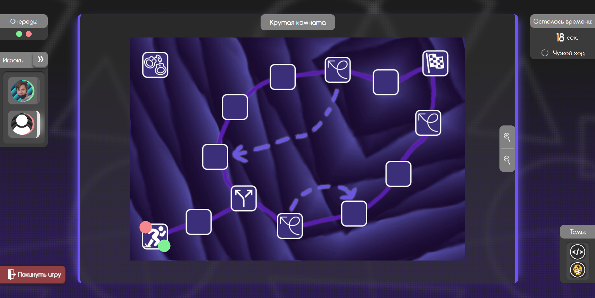
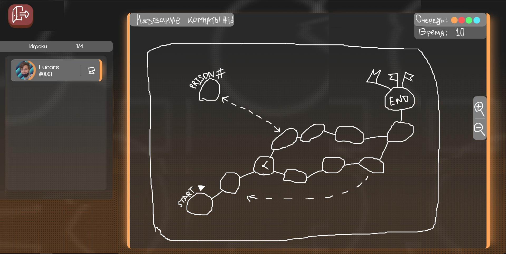
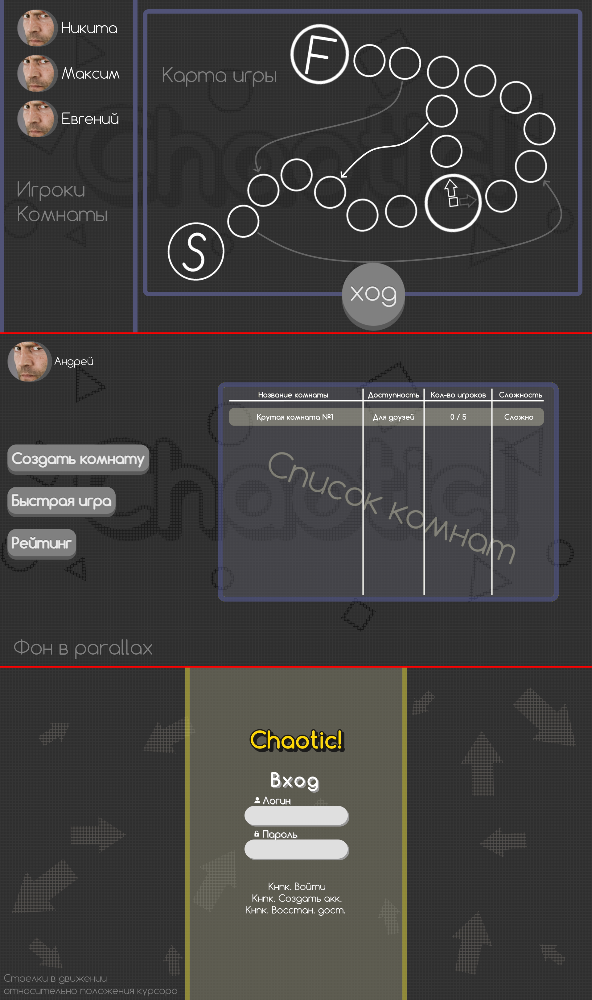

# Chaotic! 
*Прекрасная игра, играли всем Privet сервером!* (с) Андрей Козорез   
  
[Chaotic!](https://chaoticgame.ru/) представляет из себя маленький учебный проект по реализации веб-приложения с использованием библиотеки jQuery и технологи AJAX.  
Несмотря на четкое требование от преподавателя сделать проект силами группы из 6 человек, бо́льшая часть проекта была реализована силами одного члена этой группы, по совместительству её лидера -- [Lucors](https://lucors.ru/)  
  
По своей сути геймплей игры невероятно прост -- отвечать на поставленные вопросы!!  
Ответил -- выпадает случайное число -- ходишь! Не ответил -- плохо( -- сиди на месте!  
Реализован некоторый социальный функционал, в том числе: добавление в друзья, чат  
Также, в ходе разработки, все основные серверные штучки были вынесены в отдельное [API](https://chaoticgame.ru/api/), которое позволяет общаться при помощи JSON  
 
  **Джейсон Стэтхэм** не принимал участия в разработке!

Ниже вы можете лицезреть демонстрацию игрового процесса:  
  

Ниже представлены пару смешных концептов дизайна игры:  
  
  
